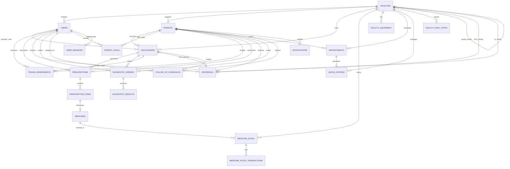
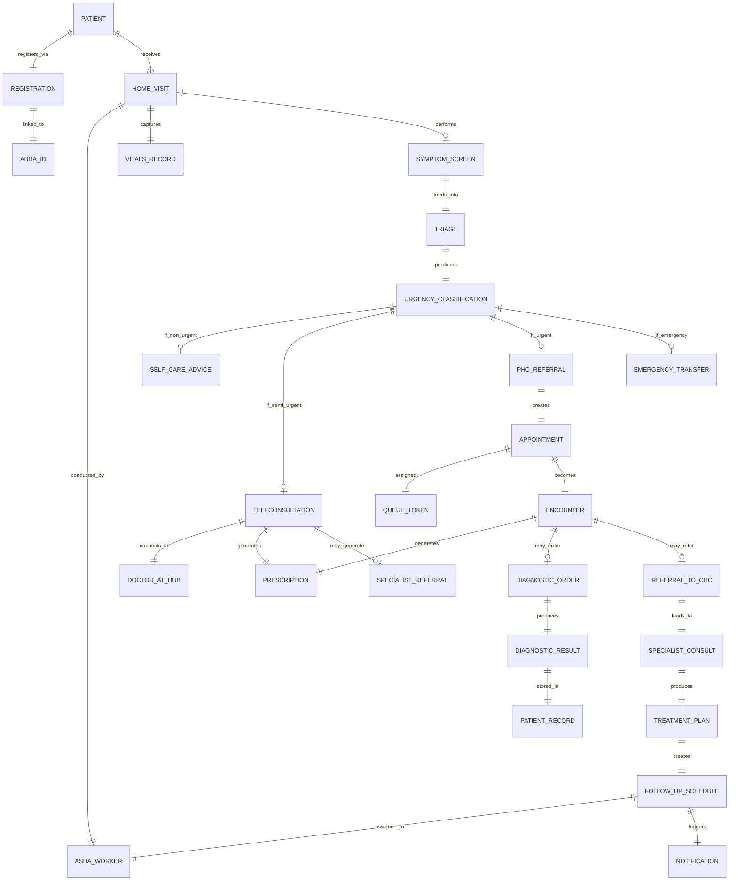
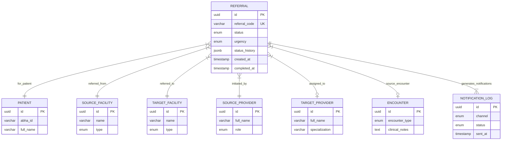
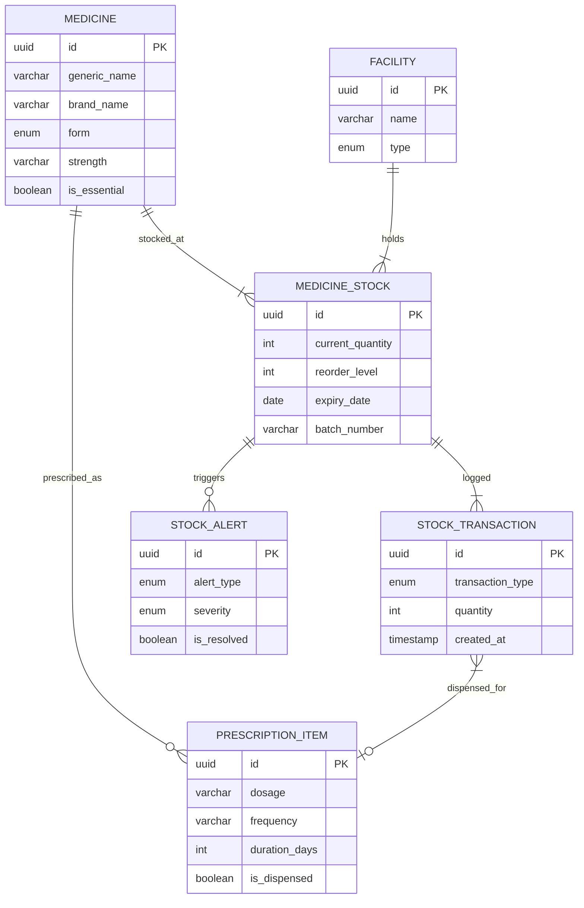
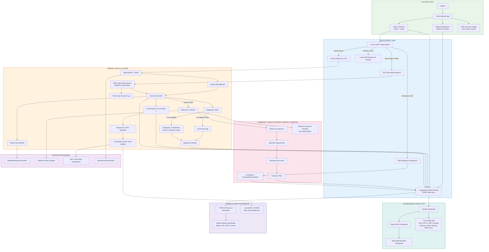

# ArogyaSetu Bridge — Database Schema & ER Diagrams
## SIH 2026 | Problem Statement 26133

---

# 1. Database Design Philosophy

The database design for ArogyaSetu Bridge follows these principles:

- **FHIR R4 Alignment:** Core clinical tables mirror HL7 FHIR R4 resource structures (Patient, Encounter, Observation, MedicationRequest, ServiceRequest) to ensure seamless ABDM interoperability.
- **Relational Integrity:** PostgreSQL with strict foreign key relationships for patient safety — no orphaned records, no dangling references.
- **JSONB Flexibility:** Clinical observations and triage responses use JSONB columns for semi-structured data that varies by condition type, while maintaining indexable structured columns for all query-critical fields.
- **Audit Trail:** Every table includes `created_at`, `updated_at`, `created_by`, and `updated_by` columns. Soft-delete pattern (`deleted_at`) prevents accidental data loss.
- **Multi-Tenancy:** Facility-scoped data with `facility_id` foreign keys on all clinical tables, enabling both facility-level isolation and cross-facility queries for referral tracking.

---

# 2. Complete Database Schema

## 2.1 Core Identity & Access Tables

### Table: `users`
Stores all system users — health workers, doctors, specialists, pharmacists, administrators.

| Column | Type | Constraints | Description |
|--------|------|-------------|-------------|
| `id` | UUID | PK, DEFAULT gen_random_uuid() | Unique user identifier |
| `abha_id` | VARCHAR(14) | UNIQUE, NULLABLE | ABHA health ID (for patients who are also users) |
| `full_name` | VARCHAR(255) | NOT NULL | Full name of the user |
| `phone` | VARCHAR(15) | NOT NULL, UNIQUE | Mobile number (primary auth) |
| `email` | VARCHAR(255) | NULLABLE | Email address |
| `role` | ENUM | NOT NULL | One of: ASHA, ANM, CHO, DOCTOR, SPECIALIST, PHARMACIST, DHO, ADMIN |
| `facility_id` | UUID | FK → facilities.id, NOT NULL | Primary assigned facility |
| `specialization` | VARCHAR(100) | NULLABLE | Medical specialization (for DOCTOR/SPECIALIST roles) |
| `license_number` | VARCHAR(50) | NULLABLE | Medical license / registration number |
| `language_pref` | VARCHAR(10) | DEFAULT 'mr' | Preferred language (mr/hi/en) |
| `is_active` | BOOLEAN | DEFAULT TRUE | Account active status |
| `last_login_at` | TIMESTAMPTZ | NULLABLE | Last successful login timestamp |
| `created_at` | TIMESTAMPTZ | DEFAULT NOW() | Record creation time |
| `updated_at` | TIMESTAMPTZ | DEFAULT NOW() | Last update time |
| `deleted_at` | TIMESTAMPTZ | NULLABLE | Soft delete timestamp |

**Indexes:** `idx_users_phone`, `idx_users_facility`, `idx_users_role`, `idx_users_abha`

---

### Table: `facilities`
Registry of all healthcare facilities in the network — Sub-Centres, PHCs, CHCs, District Hospitals.

| Column | Type | Constraints | Description |
|--------|------|-------------|-------------|
| `id` | UUID | PK | Unique facility identifier |
| `hfr_id` | VARCHAR(50) | UNIQUE, NULLABLE | Health Facility Registry ID (ABDM) |
| `name` | VARCHAR(255) | NOT NULL | Facility name |
| `type` | ENUM | NOT NULL | SUB_CENTRE, PHC, CHC, SUB_DISTRICT_HOSPITAL, DISTRICT_HOSPITAL, MEDICAL_COLLEGE |
| `address` | TEXT | NOT NULL | Full address |
| `district` | VARCHAR(100) | NOT NULL | District name |
| `taluka` | VARCHAR(100) | NOT NULL | Taluka / sub-district name |
| `state` | VARCHAR(50) | DEFAULT 'Maharashtra' | State |
| `pin_code` | VARCHAR(6) | NOT NULL | PIN code |
| `latitude` | DECIMAL(10,8) | NULLABLE | GPS latitude |
| `longitude` | DECIMAL(11,8) | NULLABLE | GPS longitude |
| `parent_facility_id` | UUID | FK → facilities.id, NULLABLE | Referral parent (e.g., PHC's parent is CHC) |
| `phone` | VARCHAR(15) | NULLABLE | Facility contact number |
| `operating_hours` | JSONB | NULLABLE | Operating schedule by day |
| `services_available` | TEXT[] | NULLABLE | Array of available services |
| `bed_count` | INT | DEFAULT 0 | Number of beds |
| `has_teleconsult` | BOOLEAN | DEFAULT FALSE | Teleconsultation capability |
| `is_active` | BOOLEAN | DEFAULT TRUE | Facility active status |
| `created_at` | TIMESTAMPTZ | DEFAULT NOW() | |
| `updated_at` | TIMESTAMPTZ | DEFAULT NOW() | |

**Indexes:** `idx_facilities_type`, `idx_facilities_district`, `idx_facilities_parent`, `idx_facilities_location` (GIST on lat/lng)

---

### Table: `user_sessions`
JWT session management and audit.

| Column | Type | Constraints | Description |
|--------|------|-------------|-------------|
| `id` | UUID | PK | Session identifier |
| `user_id` | UUID | FK → users.id, NOT NULL | |
| `token_hash` | VARCHAR(64) | NOT NULL | SHA-256 hash of JWT |
| `device_info` | JSONB | NULLABLE | Device fingerprint data |
| `ip_address` | INET | NULLABLE | |
| `expires_at` | TIMESTAMPTZ | NOT NULL | Token expiry |
| `created_at` | TIMESTAMPTZ | DEFAULT NOW() | |
| `revoked_at` | TIMESTAMPTZ | NULLABLE | Manual revocation timestamp |

---

## 2.2 Patient Management Tables

### Table: `patients`
Core patient demographic and identity record.

| Column | Type | Constraints | Description |
|--------|------|-------------|-------------|
| `id` | UUID | PK | Internal patient identifier |
| `abha_id` | VARCHAR(14) | UNIQUE, NULLABLE | ABHA health ID |
| `abha_address` | VARCHAR(255) | NULLABLE | ABHA address (name@abdm) |
| `full_name` | VARCHAR(255) | NOT NULL | Patient full name |
| `date_of_birth` | DATE | NOT NULL | Date of birth |
| `gender` | ENUM | NOT NULL | MALE, FEMALE, OTHER |
| `phone` | VARCHAR(15) | NULLABLE | Patient or guardian phone |
| `guardian_name` | VARCHAR(255) | NULLABLE | Guardian name (for minors) |
| `guardian_phone` | VARCHAR(15) | NULLABLE | Guardian contact |
| `address_line` | TEXT | NULLABLE | Address |
| `village` | VARCHAR(100) | NULLABLE | Village name |
| `taluka` | VARCHAR(100) | NULLABLE | Taluka |
| `district` | VARCHAR(100) | NULLABLE | District |
| `pin_code` | VARCHAR(6) | NULLABLE | PIN code |
| `blood_group` | VARCHAR(5) | NULLABLE | Blood group |
| `allergies` | TEXT[] | NULLABLE | Known allergies |
| `chronic_conditions` | TEXT[] | NULLABLE | Known chronic conditions |
| `is_high_risk` | BOOLEAN | DEFAULT FALSE | High-risk flag |
| `high_risk_reason` | TEXT | NULLABLE | Reason for high-risk classification |
| `preferred_language` | VARCHAR(10) | DEFAULT 'mr' | mr/hi/en |
| `registered_facility_id` | UUID | FK → facilities.id | Facility where patient was first registered |
| `registered_by` | UUID | FK → users.id | User who registered the patient |
| `consent_status` | ENUM | DEFAULT 'PENDING' | PENDING, GRANTED, REVOKED |
| `consent_granted_at` | TIMESTAMPTZ | NULLABLE | When consent was granted |
| `consent_expiry` | TIMESTAMPTZ | NULLABLE | Consent expiry date |
| `created_at` | TIMESTAMPTZ | DEFAULT NOW() | |
| `updated_at` | TIMESTAMPTZ | DEFAULT NOW() | |
| `deleted_at` | TIMESTAMPTZ | NULLABLE | |

**Indexes:** `idx_patients_abha`, `idx_patients_phone`, `idx_patients_name` (trigram for fuzzy search), `idx_patients_village_district`, `idx_patients_high_risk`

---

### Table: `patient_vitals`
Records of vital sign measurements taken at any facility or during home visits.

| Column | Type | Constraints | Description |
|--------|------|-------------|-------------|
| `id` | UUID | PK | |
| `patient_id` | UUID | FK → patients.id, NOT NULL | |
| `recorded_by` | UUID | FK → users.id, NOT NULL | Health worker who recorded |
| `facility_id` | UUID | FK → facilities.id, NOT NULL | Where vitals were recorded |
| `recorded_at` | TIMESTAMPTZ | NOT NULL, DEFAULT NOW() | Measurement time |
| `blood_pressure_systolic` | INT | NULLABLE | mmHg |
| `blood_pressure_diastolic` | INT | NULLABLE | mmHg |
| `heart_rate` | INT | NULLABLE | bpm |
| `temperature` | DECIMAL(4,1) | NULLABLE | Celsius |
| `spo2` | INT | NULLABLE | Oxygen saturation % |
| `respiratory_rate` | INT | NULLABLE | breaths/min |
| `weight` | DECIMAL(5,2) | NULLABLE | kg |
| `height` | DECIMAL(5,2) | NULLABLE | cm |
| `bmi` | DECIMAL(4,1) | NULLABLE | Calculated BMI |
| `blood_sugar_fasting` | DECIMAL(5,1) | NULLABLE | mg/dL |
| `blood_sugar_pp` | DECIMAL(5,1) | NULLABLE | mg/dL (post-prandial) |
| `notes` | TEXT | NULLABLE | Additional observations |
| `created_at` | TIMESTAMPTZ | DEFAULT NOW() | |

**Indexes:** `idx_vitals_patient_date`, `idx_vitals_facility`

---

## 2.3 Clinical & Encounter Tables

### Table: `encounters`
Every clinical interaction — consultation, teleconsultation, home visit, emergency.

| Column | Type | Constraints | Description |
|--------|------|-------------|-------------|
| `id` | UUID | PK | Encounter identifier |
| `patient_id` | UUID | FK → patients.id, NOT NULL | |
| `facility_id` | UUID | FK → facilities.id, NOT NULL | Facility of encounter |
| `provider_id` | UUID | FK → users.id, NOT NULL | Attending doctor/CHO |
| `encounter_type` | ENUM | NOT NULL | OPD, TELECONSULT_VIDEO, TELECONSULT_ASYNC, HOME_VISIT, EMERGENCY, FOLLOW_UP |
| `status` | ENUM | NOT NULL, DEFAULT 'SCHEDULED' | SCHEDULED, IN_PROGRESS, COMPLETED, CANCELLED, NO_SHOW |
| `scheduled_at` | TIMESTAMPTZ | NULLABLE | Scheduled time |
| `started_at` | TIMESTAMPTZ | NULLABLE | Actual start |
| `ended_at` | TIMESTAMPTZ | NULLABLE | Actual end |
| `chief_complaint` | TEXT | NULLABLE | Primary complaint |
| `clinical_notes` | TEXT | NULLABLE | Doctor's clinical notes |
| `diagnosis_icd_codes` | JSONB | NULLABLE | Array of ICD-10/11 codes with descriptions |
| `diagnosis_snomed_codes` | JSONB | NULLABLE | Array of SNOMED CT codes |
| `follow_up_required` | BOOLEAN | DEFAULT FALSE | |
| `follow_up_date` | DATE | NULLABLE | Scheduled follow-up date |
| `triage_id` | UUID | FK → triage_assessments.id, NULLABLE | Linked triage assessment |
| `referral_id` | UUID | FK → referrals.id, NULLABLE | If this encounter resulted from a referral |
| `teleconsult_session_id` | VARCHAR(100) | NULLABLE | WebRTC session ID |
| `fhir_resource_id` | VARCHAR(100) | NULLABLE | FHIR Encounter resource ID |
| `created_at` | TIMESTAMPTZ | DEFAULT NOW() | |
| `updated_at` | TIMESTAMPTZ | DEFAULT NOW() | |

**Indexes:** `idx_encounters_patient`, `idx_encounters_provider`, `idx_encounters_facility_date`, `idx_encounters_status`, `idx_encounters_type`

---

### Table: `triage_assessments`
Digital triage records — symptom assessment and urgency classification.

| Column | Type | Constraints | Description |
|--------|------|-------------|-------------|
| `id` | UUID | PK | |
| `patient_id` | UUID | FK → patients.id, NOT NULL | |
| `assessed_by` | UUID | FK → users.id, NOT NULL | ASHA/ANM/CHO who conducted triage |
| `facility_id` | UUID | FK → facilities.id, NOT NULL | |
| `assessed_at` | TIMESTAMPTZ | DEFAULT NOW() | |
| `symptoms` | JSONB | NOT NULL | Structured symptom checklist responses |
| `symptom_duration_days` | INT | NULLABLE | How long symptoms have been present |
| `urgency_level` | ENUM | NOT NULL | EMERGENCY, URGENT, SEMI_URGENT, NON_URGENT |
| `recommended_action` | ENUM | NOT NULL | EMERGENCY_TRANSFER, REFER_TO_PHC, REFER_TO_CHC, TELECONSULT, SELF_CARE |
| `recommended_facility_id` | UUID | FK → facilities.id, NULLABLE | System-recommended facility |
| `triage_algorithm_version` | VARCHAR(20) | NOT NULL | Algorithm version used |
| `confidence_score` | DECIMAL(3,2) | NULLABLE | 0.00 to 1.00 |
| `override_by` | UUID | FK → users.id, NULLABLE | If a doctor overrode the triage |
| `override_reason` | TEXT | NULLABLE | |
| `created_at` | TIMESTAMPTZ | DEFAULT NOW() | |

**Indexes:** `idx_triage_patient`, `idx_triage_urgency`, `idx_triage_facility_date`

---

### Table: `prescriptions`
Medication prescriptions linked to encounters.

| Column | Type | Constraints | Description |
|--------|------|-------------|-------------|
| `id` | UUID | PK | |
| `encounter_id` | UUID | FK → encounters.id, NOT NULL | |
| `patient_id` | UUID | FK → patients.id, NOT NULL | |
| `prescribed_by` | UUID | FK → users.id, NOT NULL | |
| `facility_id` | UUID | FK → facilities.id, NOT NULL | |
| `prescribed_at` | TIMESTAMPTZ | DEFAULT NOW() | |
| `is_active` | BOOLEAN | DEFAULT TRUE | |
| `notes` | TEXT | NULLABLE | General prescription notes |
| `fhir_resource_id` | VARCHAR(100) | NULLABLE | |
| `created_at` | TIMESTAMPTZ | DEFAULT NOW() | |
| `updated_at` | TIMESTAMPTZ | DEFAULT NOW() | |

---

### Table: `prescription_items`
Individual medication items within a prescription.

| Column | Type | Constraints | Description |
|--------|------|-------------|-------------|
| `id` | UUID | PK | |
| `prescription_id` | UUID | FK → prescriptions.id, NOT NULL | |
| `medicine_id` | UUID | FK → medicines.id, NULLABLE | Link to medicine catalog |
| `medicine_name` | VARCHAR(255) | NOT NULL | Medicine name (free text or from catalog) |
| `dosage` | VARCHAR(100) | NOT NULL | e.g., "500mg" |
| `frequency` | VARCHAR(100) | NOT NULL | e.g., "1-0-1" (morning-afternoon-night) |
| `duration_days` | INT | NOT NULL | Duration in days |
| `route` | VARCHAR(50) | DEFAULT 'ORAL' | ORAL, IV, IM, TOPICAL, etc. |
| `instructions` | TEXT | NULLABLE | Special instructions |
| `is_dispensed` | BOOLEAN | DEFAULT FALSE | Whether dispensed by pharmacy |
| `dispensed_at` | TIMESTAMPTZ | NULLABLE | |
| `dispensed_by` | UUID | FK → users.id, NULLABLE | |

---

## 2.4 Referral Management Tables

### Table: `referrals`
End-to-end referral tracking from initiation to completion.

| Column | Type | Constraints | Description |
|--------|------|-------------|-------------|
| `id` | UUID | PK | Referral identifier |
| `referral_code` | VARCHAR(20) | UNIQUE, NOT NULL | Human-readable referral code (e.g., REF-MH-2026-0001) |
| `patient_id` | UUID | FK → patients.id, NOT NULL | |
| `source_facility_id` | UUID | FK → facilities.id, NOT NULL | Referring facility |
| `source_provider_id` | UUID | FK → users.id, NOT NULL | Referring doctor/CHO |
| `target_facility_id` | UUID | FK → facilities.id, NOT NULL | Receiving facility |
| `target_provider_id` | UUID | FK → users.id, NULLABLE | Assigned specialist (if specific) |
| `encounter_id` | UUID | FK → encounters.id, NULLABLE | Source encounter |
| `triage_id` | UUID | FK → triage_assessments.id, NULLABLE | Linked triage |
| `referral_reason` | TEXT | NOT NULL | Clinical reason for referral |
| `urgency` | ENUM | NOT NULL | EMERGENCY, URGENT, ROUTINE |
| `status` | ENUM | NOT NULL, DEFAULT 'INITIATED' | INITIATED, ACCEPTED, SCHEDULED, IN_TRANSIT, ARRIVED, CONSULTATION_DONE, COMPLETED, REJECTED, ABANDONED |
| `status_history` | JSONB | DEFAULT '[]' | Array of {status, timestamp, updated_by, notes} |
| `clinical_summary` | TEXT | NULLABLE | Summary for receiving provider |
| `attachments` | JSONB | NULLABLE | Array of attached report/image URLs |
| `scheduled_date` | DATE | NULLABLE | Scheduled appointment at target facility |
| `completed_at` | TIMESTAMPTZ | NULLABLE | When referral was completed |
| `patient_feedback` | TEXT | NULLABLE | Patient feedback on referral experience |
| `patient_feedback_rating` | INT | NULLABLE | 1-5 rating |
| `reminder_count` | INT | DEFAULT 0 | Number of reminders sent |
| `last_reminder_at` | TIMESTAMPTZ | NULLABLE | |
| `created_at` | TIMESTAMPTZ | DEFAULT NOW() | |
| `updated_at` | TIMESTAMPTZ | DEFAULT NOW() | |

**Indexes:** `idx_referrals_patient`, `idx_referrals_source`, `idx_referrals_target`, `idx_referrals_status`, `idx_referrals_code`, `idx_referrals_urgency`

---

## 2.5 Diagnostic & Lab Tables

### Table: `diagnostic_orders`
Lab test and imaging orders.

| Column | Type | Constraints | Description |
|--------|------|-------------|-------------|
| `id` | UUID | PK | |
| `encounter_id` | UUID | FK → encounters.id, NOT NULL | |
| `patient_id` | UUID | FK → patients.id, NOT NULL | |
| `ordered_by` | UUID | FK → users.id, NOT NULL | |
| `ordering_facility_id` | UUID | FK → facilities.id, NOT NULL | Where the order was placed |
| `performing_facility_id` | UUID | FK → facilities.id, NULLABLE | Where the test will be done |
| `test_name` | VARCHAR(255) | NOT NULL | |
| `test_code_loinc` | VARCHAR(20) | NULLABLE | LOINC code |
| `test_category` | ENUM | NOT NULL | LAB, RADIOLOGY, PATHOLOGY, OTHER |
| `priority` | ENUM | DEFAULT 'ROUTINE' | STAT, URGENT, ROUTINE |
| `status` | ENUM | DEFAULT 'ORDERED' | ORDERED, SAMPLE_COLLECTED, IN_PROGRESS, COMPLETED, CANCELLED |
| `ordered_at` | TIMESTAMPTZ | DEFAULT NOW() | |
| `completed_at` | TIMESTAMPTZ | NULLABLE | |
| `notes` | TEXT | NULLABLE | |
| `created_at` | TIMESTAMPTZ | DEFAULT NOW() | |
| `updated_at` | TIMESTAMPTZ | DEFAULT NOW() | |

---

### Table: `diagnostic_results`
Results of completed diagnostic orders.

| Column | Type | Constraints | Description |
|--------|------|-------------|-------------|
| `id` | UUID | PK | |
| `order_id` | UUID | FK → diagnostic_orders.id, NOT NULL | |
| `patient_id` | UUID | FK → patients.id, NOT NULL | |
| `reported_by` | UUID | FK → users.id, NULLABLE | Lab technician / radiologist |
| `facility_id` | UUID | FK → facilities.id, NOT NULL | |
| `result_data` | JSONB | NOT NULL | Structured result values |
| `result_text` | TEXT | NULLABLE | Free-text interpretation |
| `is_abnormal` | BOOLEAN | DEFAULT FALSE | Flagged as abnormal |
| `abnormal_flags` | JSONB | NULLABLE | Specific abnormal values |
| `report_file_url` | VARCHAR(500) | NULLABLE | URL to report PDF/image |
| `fhir_resource_id` | VARCHAR(100) | NULLABLE | |
| `reported_at` | TIMESTAMPTZ | DEFAULT NOW() | |
| `created_at` | TIMESTAMPTZ | DEFAULT NOW() | |

---

### Table: `facility_equipment`
Registry of diagnostic equipment available at each facility.

| Column | Type | Constraints | Description |
|--------|------|-------------|-------------|
| `id` | UUID | PK | |
| `facility_id` | UUID | FK → facilities.id, NOT NULL | |
| `equipment_name` | VARCHAR(255) | NOT NULL | |
| `equipment_type` | ENUM | NOT NULL | XRAY, ULTRASOUND, ECG, BLOOD_ANALYZER, URINE_ANALYZER, OTHER |
| `manufacturer` | VARCHAR(255) | NULLABLE | |
| `is_operational` | BOOLEAN | DEFAULT TRUE | Current status |
| `last_maintenance_date` | DATE | NULLABLE | |
| `tests_supported` | TEXT[] | NULLABLE | List of tests this equipment can perform |
| `created_at` | TIMESTAMPTZ | DEFAULT NOW() | |
| `updated_at` | TIMESTAMPTZ | DEFAULT NOW() | |

---

## 2.6 Medicine & Pharmacy Tables

### Table: `medicines`
Master medicine catalog.

| Column | Type | Constraints | Description |
|--------|------|-------------|-------------|
| `id` | UUID | PK | |
| `generic_name` | VARCHAR(255) | NOT NULL | Generic / salt name |
| `brand_name` | VARCHAR(255) | NULLABLE | Common brand name |
| `form` | ENUM | NOT NULL | TABLET, CAPSULE, SYRUP, INJECTION, CREAM, DROPS, OTHER |
| `strength` | VARCHAR(50) | NOT NULL | e.g., "500mg", "250mg/5ml" |
| `category` | VARCHAR(100) | NULLABLE | Therapeutic category |
| `is_essential` | BOOLEAN | DEFAULT FALSE | On Essential Drug List |
| `requires_prescription` | BOOLEAN | DEFAULT TRUE | |
| `created_at` | TIMESTAMPTZ | DEFAULT NOW() | |

---

### Table: `medicine_stock`
Real-time stock levels at each facility.

| Column | Type | Constraints | Description |
|--------|------|-------------|-------------|
| `id` | UUID | PK | |
| `facility_id` | UUID | FK → facilities.id, NOT NULL | |
| `medicine_id` | UUID | FK → medicines.id, NOT NULL | |
| `current_quantity` | INT | NOT NULL, DEFAULT 0 | Current stock count |
| `unit` | VARCHAR(20) | NOT NULL | TABLETS, BOTTLES, VIALS, STRIPS, etc. |
| `reorder_level` | INT | DEFAULT 50 | Alert threshold |
| `batch_number` | VARCHAR(50) | NULLABLE | |
| `expiry_date` | DATE | NULLABLE | |
| `last_restocked_at` | TIMESTAMPTZ | NULLABLE | |
| `last_updated_by` | UUID | FK → users.id | |
| `updated_at` | TIMESTAMPTZ | DEFAULT NOW() | |

**Indexes:** `idx_stock_facility_medicine` (composite unique), `idx_stock_low` (WHERE current_quantity <= reorder_level), `idx_stock_expiry`

---

### Table: `medicine_stock_transactions`
Audit trail of all stock movements (additions and dispensations).

| Column | Type | Constraints | Description |
|--------|------|-------------|-------------|
| `id` | UUID | PK | |
| `stock_id` | UUID | FK → medicine_stock.id, NOT NULL | |
| `transaction_type` | ENUM | NOT NULL | RECEIVED, DISPENSED, EXPIRED, DAMAGED, TRANSFERRED, ADJUSTED |
| `quantity` | INT | NOT NULL | Positive for additions, negative for reductions |
| `reference_id` | UUID | NULLABLE | Link to prescription_item or transfer record |
| `performed_by` | UUID | FK → users.id, NOT NULL | |
| `notes` | TEXT | NULLABLE | |
| `created_at` | TIMESTAMPTZ | DEFAULT NOW() | |

---

## 2.7 Queue & Appointment Tables

### Table: `appointments`
Scheduled appointments at facilities.

| Column | Type | Constraints | Description |
|--------|------|-------------|-------------|
| `id` | UUID | PK | |
| `patient_id` | UUID | FK → patients.id, NOT NULL | |
| `facility_id` | UUID | FK → facilities.id, NOT NULL | |
| `provider_id` | UUID | FK → users.id, NULLABLE | Specific provider if assigned |
| `appointment_type` | ENUM | NOT NULL | OPD, TELECONSULT, FOLLOW_UP, VACCINATION, ANC_CHECKUP |
| `scheduled_date` | DATE | NOT NULL | |
| `scheduled_time` | TIME | NULLABLE | |
| `token_number` | INT | NULLABLE | Queue token |
| `estimated_wait_minutes` | INT | NULLABLE | |
| `status` | ENUM | DEFAULT 'BOOKED' | BOOKED, CHECKED_IN, IN_PROGRESS, COMPLETED, CANCELLED, NO_SHOW |
| `booked_via` | ENUM | DEFAULT 'APP' | APP, PHONE, WALK_IN, REFERRAL |
| `reminder_sent` | BOOLEAN | DEFAULT FALSE | |
| `created_at` | TIMESTAMPTZ | DEFAULT NOW() | |
| `updated_at` | TIMESTAMPTZ | DEFAULT NOW() | |

**Indexes:** `idx_appointments_facility_date`, `idx_appointments_patient`, `idx_appointments_status`

---

### Table: `queue_entries`
Real-time queue management for walk-in and checked-in patients.

| Column | Type | Constraints | Description |
|--------|------|-------------|-------------|
| `id` | UUID | PK | |
| `facility_id` | UUID | FK → facilities.id, NOT NULL | |
| `patient_id` | UUID | FK → patients.id, NOT NULL | |
| `appointment_id` | UUID | FK → appointments.id, NULLABLE | |
| `token_number` | INT | NOT NULL | |
| `counter` | VARCHAR(20) | NULLABLE | Counter/room assignment |
| `status` | ENUM | DEFAULT 'WAITING' | WAITING, CALLED, IN_CONSULTATION, DONE, SKIPPED |
| `priority` | INT | DEFAULT 5 | 1 = highest priority (emergency) |
| `entered_at` | TIMESTAMPTZ | DEFAULT NOW() | |
| `called_at` | TIMESTAMPTZ | NULLABLE | |
| `completed_at` | TIMESTAMPTZ | NULLABLE | |

---

## 2.8 Follow-Up & Notifications Tables

### Table: `follow_up_schedules`
Automated follow-up tracking for high-risk patients and chronic conditions.

| Column | Type | Constraints | Description |
|--------|------|-------------|-------------|
| `id` | UUID | PK | |
| `patient_id` | UUID | FK → patients.id, NOT NULL | |
| `encounter_id` | UUID | FK → encounters.id, NULLABLE | |
| `assigned_to` | UUID | FK → users.id, NOT NULL | ASHA/ANM responsible |
| `follow_up_type` | ENUM | NOT NULL | ANC, PNC, CHRONIC_DISEASE, POST_SURGERY, IMMUNIZATION, GENERAL |
| `scheduled_date` | DATE | NOT NULL | |
| `status` | ENUM | DEFAULT 'PENDING' | PENDING, COMPLETED, OVERDUE, CANCELLED |
| `priority` | ENUM | DEFAULT 'NORMAL' | HIGH, NORMAL, LOW |
| `notes` | TEXT | NULLABLE | |
| `completed_at` | TIMESTAMPTZ | NULLABLE | |
| `completed_notes` | TEXT | NULLABLE | |
| `reminder_count` | INT | DEFAULT 0 | |
| `created_at` | TIMESTAMPTZ | DEFAULT NOW() | |
| `updated_at` | TIMESTAMPTZ | DEFAULT NOW() | |

**Indexes:** `idx_followup_patient`, `idx_followup_assigned`, `idx_followup_status_date`

---

### Table: `notifications`
System-generated notifications for all user types.

| Column | Type | Constraints | Description |
|--------|------|-------------|-------------|
| `id` | UUID | PK | |
| `recipient_user_id` | UUID | FK → users.id, NULLABLE | For provider notifications |
| `recipient_patient_id` | UUID | FK → patients.id, NULLABLE | For patient notifications |
| `recipient_phone` | VARCHAR(15) | NULLABLE | Phone for SMS delivery |
| `channel` | ENUM | NOT NULL | SMS, WHATSAPP, PUSH, IN_APP |
| `category` | ENUM | NOT NULL | APPOINTMENT_REMINDER, REFERRAL_UPDATE, MEDICINE_REMINDER, STOCK_ALERT, FOLLOW_UP_DUE, EMERGENCY, SYSTEM |
| `title` | VARCHAR(255) | NOT NULL | |
| `body` | TEXT | NOT NULL | |
| `language` | VARCHAR(10) | DEFAULT 'mr' | |
| `status` | ENUM | DEFAULT 'QUEUED' | QUEUED, SENT, DELIVERED, FAILED, READ |
| `sent_at` | TIMESTAMPTZ | NULLABLE | |
| `read_at` | TIMESTAMPTZ | NULLABLE | |
| `reference_type` | VARCHAR(50) | NULLABLE | e.g., 'referral', 'appointment' |
| `reference_id` | UUID | NULLABLE | ID of referenced entity |
| `created_at` | TIMESTAMPTZ | DEFAULT NOW() | |

---

## 2.9 Analytics & Audit Tables

### Table: `facility_daily_stats`
Aggregated daily statistics for facility dashboards.

| Column | Type | Constraints | Description |
|--------|------|-------------|-------------|
| `id` | UUID | PK | |
| `facility_id` | UUID | FK → facilities.id, NOT NULL | |
| `stat_date` | DATE | NOT NULL | |
| `total_patients_seen` | INT | DEFAULT 0 | |
| `total_teleconsults` | INT | DEFAULT 0 | |
| `total_referrals_sent` | INT | DEFAULT 0 | |
| `total_referrals_received` | INT | DEFAULT 0 | |
| `referrals_completed` | INT | DEFAULT 0 | |
| `avg_wait_time_minutes` | DECIMAL(5,1) | NULLABLE | |
| `medicines_out_of_stock` | INT | DEFAULT 0 | |
| `high_risk_patients_active` | INT | DEFAULT 0 | |
| `follow_ups_completed` | INT | DEFAULT 0 | |
| `follow_ups_overdue` | INT | DEFAULT 0 | |
| `created_at` | TIMESTAMPTZ | DEFAULT NOW() | |

**Indexes:** `idx_stats_facility_date` (composite unique)

---

### Table: `audit_log`
Immutable audit trail for all data access and modifications.

| Column | Type | Constraints | Description |
|--------|------|-------------|-------------|
| `id` | BIGSERIAL | PK | Auto-incrementing for ordering |
| `user_id` | UUID | FK → users.id, NULLABLE | |
| `action` | ENUM | NOT NULL | CREATE, READ, UPDATE, DELETE, LOGIN, LOGOUT, EXPORT, CONSENT_GRANT, CONSENT_REVOKE |
| `resource_type` | VARCHAR(50) | NOT NULL | Table/entity name |
| `resource_id` | UUID | NULLABLE | ID of affected record |
| `facility_id` | UUID | FK → facilities.id, NULLABLE | |
| `ip_address` | INET | NULLABLE | |
| `details` | JSONB | NULLABLE | Additional context |
| `created_at` | TIMESTAMPTZ | DEFAULT NOW() | |

**Indexes:** `idx_audit_user`, `idx_audit_resource`, `idx_audit_timestamp`

---

## 2.10 Sync & Offline Tables

### Table: `sync_queue`
Tracks pending data synchronizations from offline devices.

| Column | Type | Constraints | Description |
|--------|------|-------------|-------------|
| `id` | UUID | PK | |
| `device_id` | VARCHAR(100) | NOT NULL | Device identifier |
| `user_id` | UUID | FK → users.id, NOT NULL | |
| `entity_type` | VARCHAR(50) | NOT NULL | Table name |
| `entity_id` | UUID | NOT NULL | Record ID |
| `operation` | ENUM | NOT NULL | INSERT, UPDATE, DELETE |
| `payload` | JSONB | NOT NULL | Full record data |
| `client_timestamp` | TIMESTAMPTZ | NOT NULL | When change was made on device |
| `server_timestamp` | TIMESTAMPTZ | NULLABLE | When synced to server |
| `sync_status` | ENUM | DEFAULT 'PENDING' | PENDING, SYNCED, CONFLICT, FAILED |
| `conflict_resolution` | JSONB | NULLABLE | Resolution details if conflict |
| `retry_count` | INT | DEFAULT 0 | |
| `created_at` | TIMESTAMPTZ | DEFAULT NOW() | |

**Indexes:** `idx_sync_device_status`, `idx_sync_entity`

---

# 3. Entity-Relationship Diagrams

## 3.1 Main ER Diagram — Full System Overview

## 3.2 Patient Care Journey ER Diagram

## 3.3 Referral Tracking ER Diagram

## 3.4 Medicine Stock Management ER Diagram

---

## 2.6 Operational, Incentive & Supply Chain Tables

### Table: `asha_incentives`
Automated National Health Mission (NHM) performance incentive ledger for frontline community health workers.

| Column | Type | Constraints | Description |
|--------|------|-------------|-------------|
| `id` | UUID | PK, DEFAULT gen_random_uuid() | Unique claim voucher identifier |
| `asha_user_id` | UUID | FK → users.id, NOT NULL | ASHA worker filing the claim |
| `patient_id` | UUID | FK → patients.id, NOT NULL | Associated beneficiary |
| `encounter_id` | UUID | FK → encounters.id, NULLABLE | Associated clinical encounter / referral |
| `activity_type` | ENUM | NOT NULL | JSY_DELIVERY (₹300), HRP_FOLLOWUP (₹250), VHSND_IMMUNIZATION (₹100), NCD_CBAC (₹10) |
| `amount_inr` | DECIMAL(10,2)| NOT NULL | Approved incentive amount in INR |
| `status` | ENUM | DEFAULT 'PENDING' | PENDING, VERIFIED_BY_ANM, APPROVED_BY_MO, DISBURSED |
| `claim_date` | DATE | NOT NULL | Date activity was completed in field |
| `verified_by` | UUID | FK → users.id, NULLABLE | ANM / CHO supervisor who verified field diary |
| `disbursed_at` | TIMESTAMPTZ | NULLABLE | Direct Benefit Transfer (DBT) disbursement time |
| `created_at` | TIMESTAMPTZ | DEFAULT NOW() | Record creation timestamp |

**Indexes:** `idx_asha_inc_user`, `idx_asha_inc_status`, `idx_asha_inc_date`

---

### Table: `drug_inventory_batches`
Batch-level pharmaceutical inventory with First-Expired, First-Out (FEFO) prioritization and e-Aushadhi / DVDMS synchronization.

| Column | Type | Constraints | Description |
|--------|------|-------------|-------------|
| `id` | UUID | PK | Unique batch entry identifier |
| `facility_id` | UUID | FK → facilities.id, NOT NULL | Facility holding the physical stock |
| `medicine_id` | UUID | FK → medicines.id, NOT NULL | Pharmaceutical master catalog reference |
| `batch_number` | VARCHAR(50) | NOT NULL | Manufacturer batch identifier |
| `manufacture_date`| DATE | NOT NULL | Manufacturing timestamp |
| `expiry_date` | DATE | NOT NULL | Expiry date for FEFO queue ranking |
| `quantity_available`| INT | NOT NULL, CHECK >= 0 | Real-time units in stock |
| `buffer_threshold`| INT | DEFAULT 50 | Minimum buffer level triggering inter-facility transfer |
| `eaushadhi_batch_id`| VARCHAR(100)| NULLABLE | State DVDMS sync identifier |
| `last_synced_at`| TIMESTAMPTZ | NULLABLE | Last sync timestamp with state warehouse |

**Indexes:** `idx_drug_batch_fefo` (facility_id, medicine_id, expiry_date ASC), `idx_drug_batch_eaushadhi`

---

### Table: `teleconsult_consents`
Legal consent repository mandated by the NMC Telemedicine Practice Guidelines (2020) and DPDP Act 2023.

| Column | Type | Constraints | Description |
|--------|------|-------------|-------------|
| `id` | UUID | PK | Unique consent record identifier |
| `encounter_id` | UUID | FK → encounters.id, NOT NULL | Linked teleconsultation encounter |
| `patient_id` | UUID | FK → patients.id, NOT NULL | Patient granting consent |
| `doctor_id` | UUID | FK → users.id, NOT NULL | Registered Medical Practitioner on-call |
| `consent_type` | ENUM | NOT NULL | VERBAL_AUDIO_WEBRTC, SMS_OTP, BIOMETRIC, WRITTEN_PROXY |
| `audio_recording_url`| VARCHAR(500)| NULLABLE | Secure URL to encrypted verbal consent snippet |
| `consent_timestamp`| TIMESTAMPTZ | NOT NULL | Tamper-evident recording timestamp |
| `is_valid` | BOOLEAN | DEFAULT TRUE | Consent validity flag |
| `created_at` | TIMESTAMPTZ | DEFAULT NOW() | |

**Indexes:** `idx_tc_consent_encounter`, `idx_tc_consent_patient`

---

# 4. Technical Data Flow — Main ER Diagram

This diagram shows the complete data flow across the platform from patient entry to state-level analytics.

---

# 5. Summary Statistics

| Metric | Count |
|--------|-------|
| **Total Tables** | **25** (Expanded with ASHA Incentives, FEFO Batches, and Legal Consents) |
| Core Entity Tables | 5 (users, patients, facilities, encounters, referrals) |
| Clinical Tables | 7 (vitals, triage, prescriptions, prescription_items, diagnostic_orders, diagnostic_results, teleconsult_consents) |
| Support & Supply Chain Tables | 9 (medicines, stock, stock_transactions, drug_inventory_batches, equipment, appointments, queue, follow_ups, asha_incentives) |
| System & Audit Tables | 4 (notifications, audit_log, sync_queue, user_sessions, facility_daily_stats) |
| Total Relationships | 52+ foreign key relationships with strict referential integrity |
| FHIR R4 Aligned Entities | 8 (Patient, Encounter, Observation, MedicationRequest, ServiceRequest, DiagnosticReport, Appointment, Organization) |

---

*Database schema designed for ArogyaSetu Bridge — SIH 2026, PS 26133*  
*All diagrams use Mermaid notation for portability and version control.*
